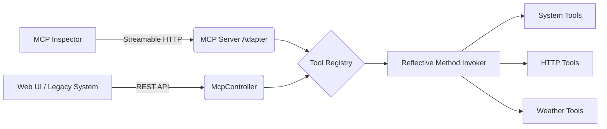

# Java MCP Framework
> **Enterprise-grade Model Context Protocol implementation using Java 17, Spring Boot 3.3, and Spring AI 2.0 (M2)**

---

## 📘 Project Overview

The **Java MCP Framework** is a modular integration framework implementing the **Model Context Protocol (MCP)**.  
It enables **Large Language Models (LLMs)** to securely interact with local system capabilities, external APIs, and custom business logic through a standardized, typed interface.

### 🔑 Industry Keywords
`MCP Server` • `JSON-RPC 2.0` • `Streamable HTTP` • `Dynamic Tool Discovery` • `Reflective Annotation Scanning` • `Spring AI` • `LLM Tool Calling` • `Function Calling` • `RESTful Control Plane`

---

## ⚙️ Core Features and Technical Implementation

### 1. Hybrid Interface Architecture
- **Official MCP Endpoint (`/mcp`)** – Implements the **Streamable HTTP** protocol for native compatibility with the **:contentReference[oaicite:0]{index=0}**, :contentReference[oaicite:1]{index=1}, and other high-performance AI clients.  
- **RESTful Control Plane (`/api/mcp/*`)** – Custom HTTP endpoints for manual system monitoring, health checks (`/health`), and programmatic tool orchestration.

### 2. Intelligent Tool Registry
- **Dynamic Discovery** – A centralized `ToolRegistry` automatically detects integration beans using Spring’s `ApplicationContext`.  
- **Reflective Invocation** – Uses Java Reflection to dynamically map incoming JSON-RPC arguments to method parameters, supporting complex types via `Map<String, Object>`.  
- **Extensible Adapter Pattern** – An `IntegrationAdapter` base class enables developers to wrap legacy libraries or third-party APIs into AI-ready tools with minimal effort.

### 3. Declarative Programming Model
- **Custom Annotation Scanner** – Supports both internal `@McpTool` logic and official **Spring AI** annotations.  
- **Automatic Schema Generation** – Translates Java method metadata into JSON Schema for LLM prompt injection and MCP specification compliance.

---

## 🧱 Technical Architecture

---
| Feature            | Command / Description                                                                                                       |
| ------------------ | --------------------------------------------------------------------------------------------------------------------------- |
| **MCP Protocol**   | Connect the [MCP Inspector](https://inspector.modelcontextprotocol.io) to `http://localhost:8080/mcp` using Streamable HTTP |
| **Health Status**  | `curl http://localhost:8080/api/mcp/health`                                                                                 |
| **Tool Inventory** | `curl http://localhost:8080/api/mcp/tools`                                                                                  |

Maven 3.8+

Spring AI 2.0.0-M2 Bill of Materials (BOM)
